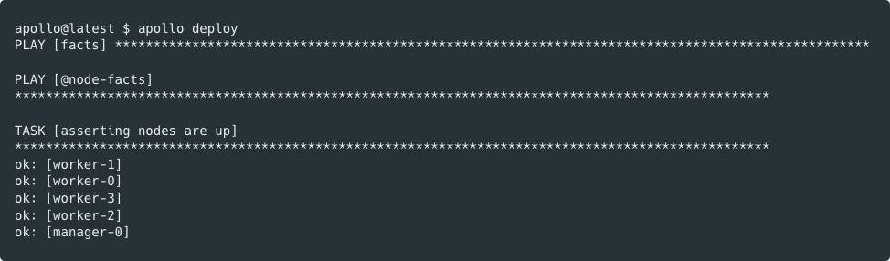
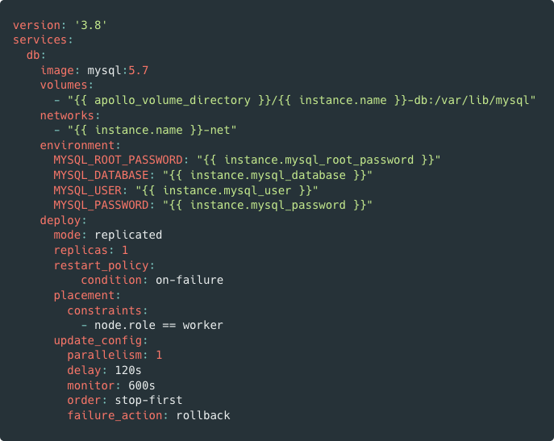
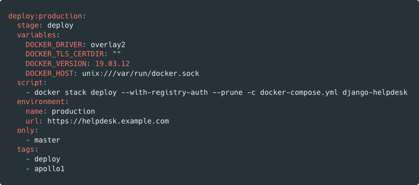
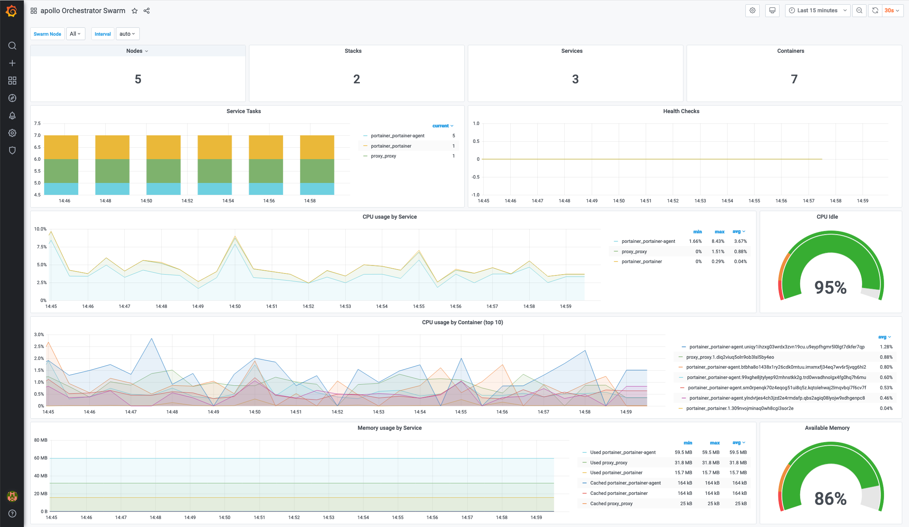
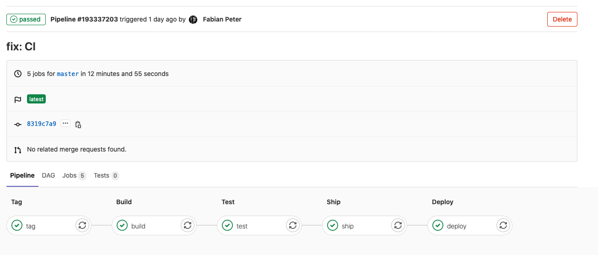
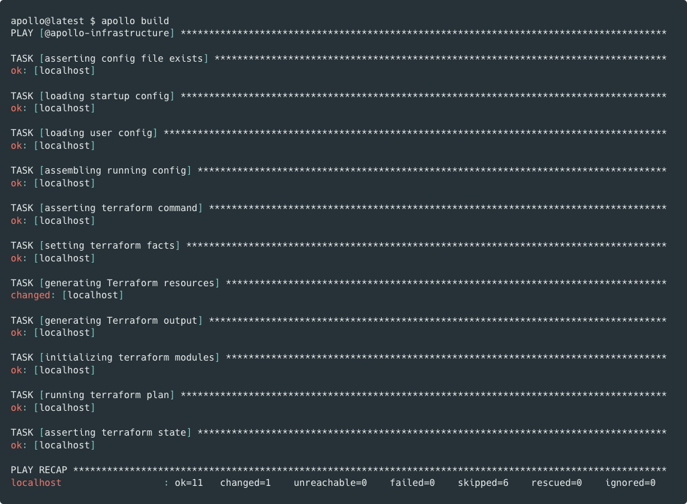
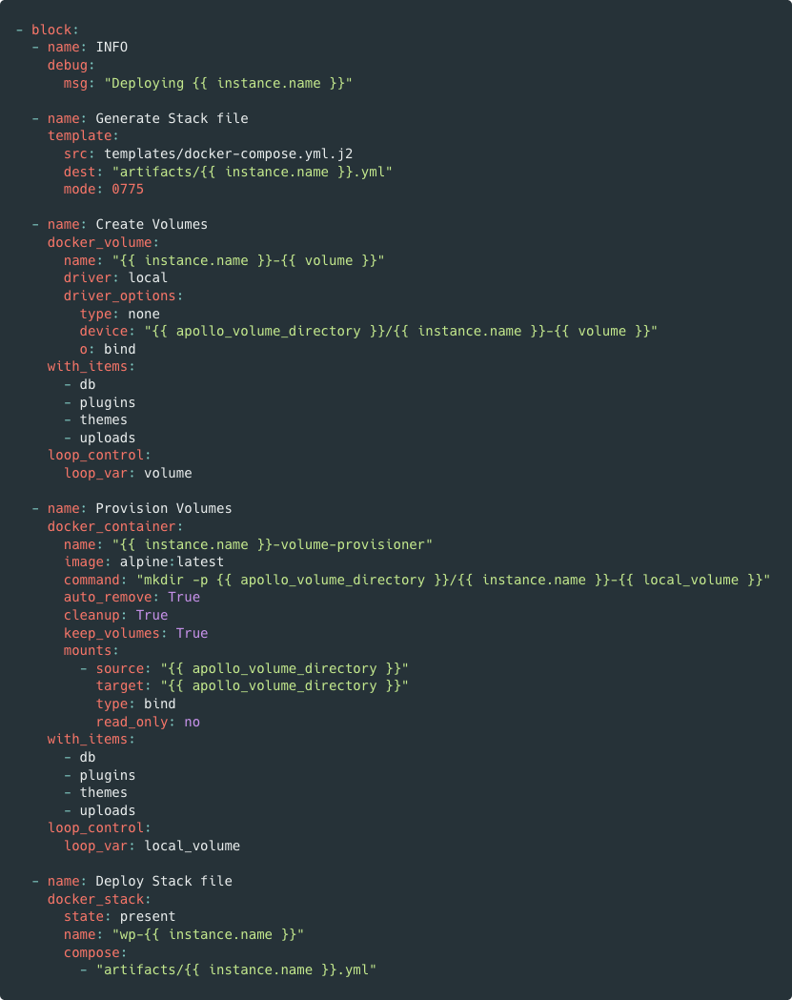

# What is apollo?

apollo is an extensible Docker-based Platform as a Service (PaaS) that helps to get from idea to production fast and safe.

With apollo, you’re up & running quickly with a cloud-native tech-stack and great operational stability.

Use this repository as a boilerplate for your own platform or manage your [apollo spaces](#-) using our batteries-included [Docker image](#-).

[](https://github.com/wearep3r/apollo)
[](https://github.com/wearep3r/apollo)
[](https://github.com/wearep3r/apollo)
[](https://join.slack.com/t/wearep3r/shared_invite/zt-d9ao21f9-pb70o46~82P~gxDTNy_JWw)
[](https://gitlab.com/p3r.one/apollo)
[](https://github.com/wearep3r/apollo)
[](https://hub.docker.com/r/wearep3r/apollo)
[](https://hub.docker.com/r/wearep3r/apollo)

## Demo time!

[](https://www.youtube.com/watch?v=iT2PLSC0bwI)

## Features

### Get going fast

Get started with a simple development environment, grow with your requirements.



### Run anything

apollo is built for 12 factor apps. Run any application written in any language or framework in Docker Swarm or Kubernetes using standard tooling like `docker-compose`.



Learn more

### Deploy fast and safe

Use the tooling you already mastered, no need to learn new workflows. Hook up your Repo, git push and deploy.



Learn more

### Scale

Grow your application dynamically allocating resources as needed from a user-friendly dashboard.


Learn more

### Monitor everything

apollo delivers real-time metrics and logs from your applications out-of-the-box. Dashboards included!



Learn more

### GitOps Workflows

apollo spaces can be built, versioned and deployed just like your apps - automate your platform operations with [GitLab](https://docs.gitlab.com/ee/ci/) and [shipmate](https://gitlab.com/peter.saarland/shipmate).



Learn more

### IaaS integrated

apollo is integrated with Terraform which makes auto-provisioning infrastructure simple, painless and fast.



Learn more

## Extensible

apollo can easily be extended with Ansible, a proven automation framework.



## What's inside

apollo manages the full **life-cycle of a container platform**:

- creation of infrastructure
- provisioning of configuration
- monitoring of resources
- logging of events
- alerting of incidents
- visualization of metrics
- management of operations
- deployment of applications
- elemination of waste

We call those platforms **spaces**.

### More features

- Distributed container platform (**Docker Swarm** or **Kubernetes**)
- Git-versioned configuration method tailored to CI/CD 
- Automated infrastructure (currently only **DigitalOcean** and **HETZNER Cloud** supported)
- Ready-to-rock, auto-ssl ingress proxy with **Traefik**
- Cluster-wide metrics & logs with **Victoria Metrics** and **Grafana Loki**
- Secure cluster networking through **Wireguard**
- Beautiful dashboards thanks to **Grafana**
- Distributed storage (**Storidge**, **NFS** or **Longhorn**)
- **Single-node clusters are possible** and can be scaled up
- Integrated with [GitLab](https://gitlab.com) (CI/CD, registry, environments, metrics, kubernetes)
- Support for configuration encryption, auditing and Continuous Delivery

## What you can do with it

1. Single-node Docker-Hosts for [Remote Development with VSCode](https://code.visualstudio.com/docs/remote/remote-overview)
2. Multi-node Docker-Clusters for [SaaS apps](https://dockerswarm.rocks/)
3. Single- or Multi-Node [Kubernetes clusters](https://k3s.io/)
4. Auto-Managed [distributed storage](https://storidge.com/) for stateful applications
5. Auto-Managed [GitLab Runners](https://docs.gitlab.com/runner/) on trusted hardware
6. Stable and secure [S3 storage](https://min.io/)
7. Multiple [environments](https://www.digitalocean.com/community/tutorials/an-introduction-to-ci-cd-best-practices) (staging, production)
8. [GitLab Review Apps](https://docs.gitlab.com/ee/ci/review_apps/)
9. [Self-hosting](https://geek-cookbook.funkypenguin.co.nz/) arbitrary apps
10. One-shot ephemeral clusters for [testing in CI/CD](https://dev.to/katiatalhi/provision-ephemeral-kubernetes-clusters-on-aws-eks-using-terraform-and-gitlab-ci-cd-3f74)
11. [Federated monitoring](https://banzaicloud.com/blog/prometheus-federation/) with Prometheus and Grafana
12. [Hybrid clusters](https://www.packet.com/resources/guides/crosscloud-vpn-with-wireguard/) (thanks to Wireguard)

## How it works

1. You supply [minimum configuration](#getting-started) to create a **space**
2. apollo creates infrastructure if needed
3. apollo configures the machines and sets up your container platform
4. You check out the auto-generated README to know the next steps

Check the [Getting Started](#getting-started) section to start your journey with apollo.

## Philosophy

These are the design principles we base our work on apollo on. It's heavily inspired by DevOps and Clean Code practices and the works and arts of Martin Fowler who brought us immutable infrastructure. Still a long way to go. 

- Developers and operators should be able to trust their infrastructure and platform
- Every **space** should be versioned in a repository
- Configuration should be declarative
- There should be one workflow for installation and deployment that applies to all spaces
- No manual actions on the platform - everything must be code
- Every change to infrastructure should be code-reviewed to:
  - avoid mistakes
  - make other team members able to learn
  - make sure everything stays portable and immutable
- Everyone SHOULD be able to:
  - create their development environment with minimum effort
  - reproduce a production-like environment
  - understand the whole infrastructure
  - propose modifications to the infrastructure, while being able to test them
- apollo is a boilerplate and a framework - it should be customizable but still predictable

apollo is tailored to development teams. It's made by seasoned operators and contains everything a DevOps-enabled team needs to start changing the world.

It runs on every major and minor cloud provider or directly on bare-metal. IoT devices or platforms like Proxmox and VMWare are currently on the roadmap.

apollo is based on the latest technologies and design patterns. We're working hard to make it fully automated but it already reduces lots of the operational overhead in organizations. It's a DevOps platform, doing ops work automagically for you, so you can do developer magic on top of it.

## Knowledge prerequisites

If you want to use apollo to manage your container platforms, you just need to know:

- Docker

If you want to build upon this repository, you'll need to be very proficient with the following tools:

- Ansible
- Terraform
- Bash
- Docker
- Python
- Docker Swarm
- Kubernetes

## Technical prerequisites

- Local machine: Docker
- Remote machines: Ubuntu 18.04

apollo requires a manager- or control-node. We call this `manager-0`. This node runs the entire controlplane and monitoring stack for a cluster and should be sized appropriately (8GB Memory, 2-4 vCPUs).

apollo can have additional managers (up to 3 in total) as well as an arbitrary number of workers to deal with your workloads. Make sure to adjust manager-size to your number of workers. The more nodes your cluster has, the more resources cluster-operations will need.

## Getting started

The simplest way to use **apollo** is to run our [Docker Image](https://gitlab.com/p3r.one/apollo/container_registry/eyJuYW1lIjoicDNyLm9uZS9hcG9sbG8iLCJ0YWdzX3BhdGgiOiIvcDNyLm9uZS9hcG9sbG8vcmVnaXN0cnkvcmVwb3NpdG9yeS8xMjcwMTkyL3RhZ3M%2FZm9ybWF0PWpzb24iLCJpZCI6MTI3MDE5Mn0=).

### Prerequisites

You need to install [Docker](https://docs.docker.com/get-docker/). Once done, create a directory that holds apollo's configuration and the [spaces](#-) apollo manages:

```bash
mkdir -p $HOME/.apollo
```

### Installing apollo

Download apollo's Docker Image from our registry:

```bash
docker pull registry.gitlab.com/p3r.one/apollo:latest
```

### Running apollo

Run apollo's Docker Image (**apollo** needs access to a few local directories to work properly):

```bash
docker run --rm -it \
  --name apollo \
  -v ${HOME}/.ssh:/root/.ssh \
  -v ${HOME}/.gitconfig:/root/.gitconfig \
  -v ${HOME}/.apollo:/root/.apollo \
  -v ${PWD}:/cargo \
  registry.gitlab.com/p3r.one/apollo:${APOLLO_VERSION:-latest}
```

From inside the image, you can use the apollo CLI to manage your spaces.

**PRO TIP**: Save this **alias** to the `.zshrc` or `.bashrc` file on your local machine to get quick access to **apollo** from your local terminal:

```bash
alias apollo="mkdir -p $HOME/.apollo; docker run --rm -it --name apollo -v ${HOME}/.ssh:/root/.ssh -v ${HOME}/.gitconfig:/root/.gitconfig -v ${PWD}:/cargo -v ${HOME}/.apollo:/root/.apollo registry.gitlab.com/p3r.one/apollo:${APOLLO_VERSION:-latest}"
```

From now on we will assume you created the alias for quick access to apollo.

### Create your first space

Open a new terminal and run `apollo init`. You will be presented with a prompt to fill in some configuration:

```bash
$ apollo init
Initializing apollo config
Name: demo-1
Base Domain: example.com
E-mail: info@example.com
Enable infrastructure [y/N]:
Config saved to /root/.apollo/.spaces/demo-1.space/Spacefile.yml
```

Your first space has been created and should contain a few files:

- `Spacefile.yml` based on your input and the [defaults](defaults.yml)
- a `.ssh` directory containing an auto-generated ssh-keypair

Now let's go to your space directory: `cd $HOME/.apollo/.spaces/demo-1.space`

**HINT**: inside the apollo container everything runs as `root` this is why the CLI reports the created space to live in `/root/.apollo`. Assuming you copied the alias as-is, `/root/.apollo` inside the container is mounted from your local `$HOME/.apollo` so you'll find your apollo spaces in your local home directory.

From here, you can adjust `Spacefile.yml` to your needs. You should also setup infrastructure if not already done during `apollo init`. You got three options to provide infrastructure for apollo:

1. configure the `infrastructure` section in `Spacefile.yml` to spin up resources at a cloud provider (currently only `hcloud` and `digitalocean` are supported), then invoke `apollo build` to create the infrastructure
2. provide a manual `Nodesfile.yml` pointing to your existing infrastructure. Make sure you add the auto-generated ssh-key of the `init` step to your nodes so apollo can provision them
3. integrate with Terraform and generate `Nodesfile.yml` in `output.tf` from [this](playbooks/templates/infrastructure/hcloud/output.tf) template

### Deploy a space

Deploying apollo is easy.

**HINT**: If you don't specify a custom space directory with `--space-dir $HOME/custom`, apollo assumes that your current working directory is your space directory and tries to load its configuration from there. apollo maps your `$PWD` to a special directory named `/cargo` inside the apollo container.

```bash
$ apollo deploy
```

**PRO TIP**: using the `apollo` alias on your local machine, you can specify the version to run this way: `export APOLLO_VERSION=v2.0.0; apollo deploy`

After successful deployment, a fresh and updated `README.md` can be found in your space directory. It contains valuable information and quick-links as well as troubleshooting information for your space.

## Built With

- Ansible
- Terraform
- bash/zsh
- GitLab
- Docker
- make
- python
- docker-compose

## Contributing

Please read [CONTRIBUTING.md](CONTRIBUTING.md) for details on our code of conduct, and the process for submitting pull/merge requests to us. This software is primarily developed and maintained on [GitLab](https://gitlab.com/p3r.one/apollo).

## Versioning

We use SemVer for versioning, automated by [shipmate](https://gitlab.com/peter.saarland/shipmate). For the versions available, see the tags on this repository.

## Authors

- Fabian Peter

See also the list of contributors who participated in this project.

## License

This project is licensed under the MIT License - see the [LICENSE](LICENSE) file for details.

## Acknowledgments

There's so many people to thank for being awesome and providing open source software and support for it.

## Disclaimer

This software is maintained and commercially supported by [p3r.](https://www.p3r.one). You can reach us here:

- [Web](https://www.p3r.one)
- [Slack](https://join.slack.com/t/wearep3r/shared_invite/zt-d9ao21f9-pb70o46~82P~gxDTNy_JWw)
- [GitLab](https://gitlab.com/p3r.one)
- [GitHub](https://github.com/wearep3r/)
- [LinkedIn](https://www.linkedin.com/company/wearep3r)
