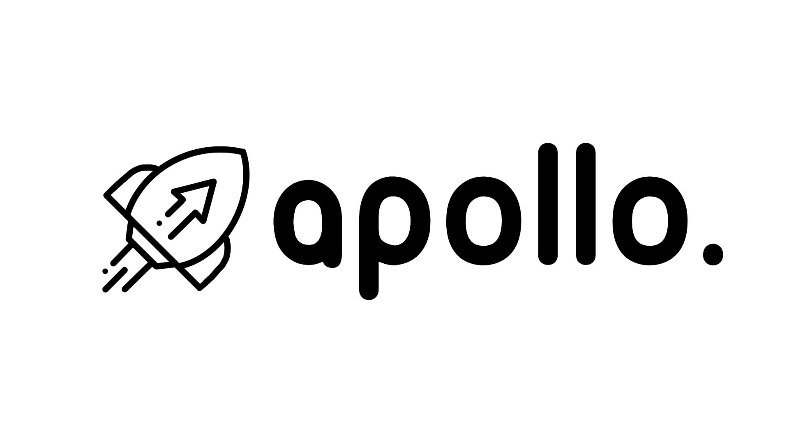

# Apollo. - Platform as a Service toolkit

## 🚀 Documentation

- [Get Started](docs/get-started.md)
- [FAQ](docs/faq.md)

This software is maintained and commercially supported by [Peter.SAARLAND | DevOps Consultants](https://www.peter.saarland).

## 🚀 Related Links

- [apollo](https://gitlab.com/peter.saarland/apollo/) - Platform as a Service toolkit
- [lake0](https://gitlab.com/peter.saarland/lake0/) - Container-native Backups
- [ns0](https://gitlab.com/peter.saarland/ns0/) - Container-native DNS Proxy
- [shipmate](https://gitlab.com/peter.saarland/shipmate/) - Advanced Software Logistics
- [shopware](https://gitlab.com/peter.saarland/shopware/) - Shopware 5 in Docker

## 🚀 Contact

- [Slack](https://join.slack.com/t/petersaarland/shared_invite/zt-d9ao21f9-pb70o46~82P~gxDTNy_JWw)
- [LinkedIn](https://www.linkedin.com/company/peter-saarland)
- [XING](https://www.xing.com/profile/Fabian_Peter4/cv)
- [GitLab](https://gitlab.com/peter.saarland)
- [GitHub](https://github.com/Peter-SAARLAND/)
- [Matrix](https://matrix.to/#/!RcYHgbzWjyNTYeEIZj:hello.peter.saarland?via=hello.peter.saarland)