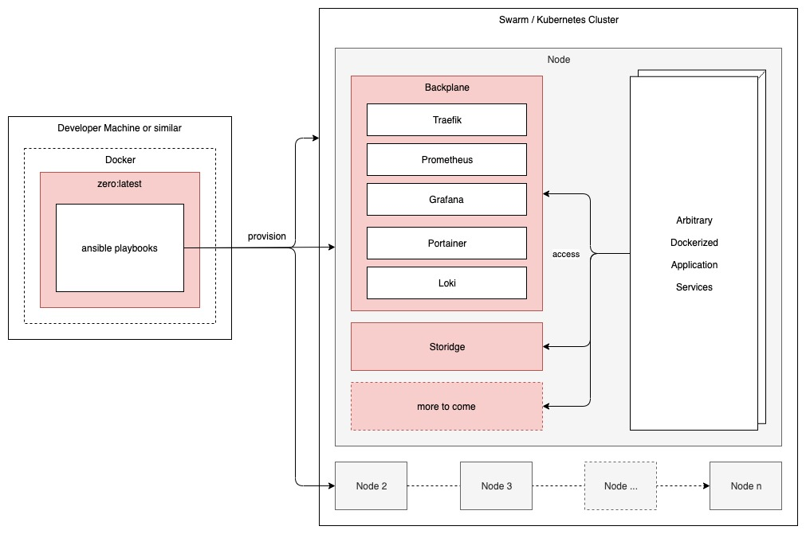
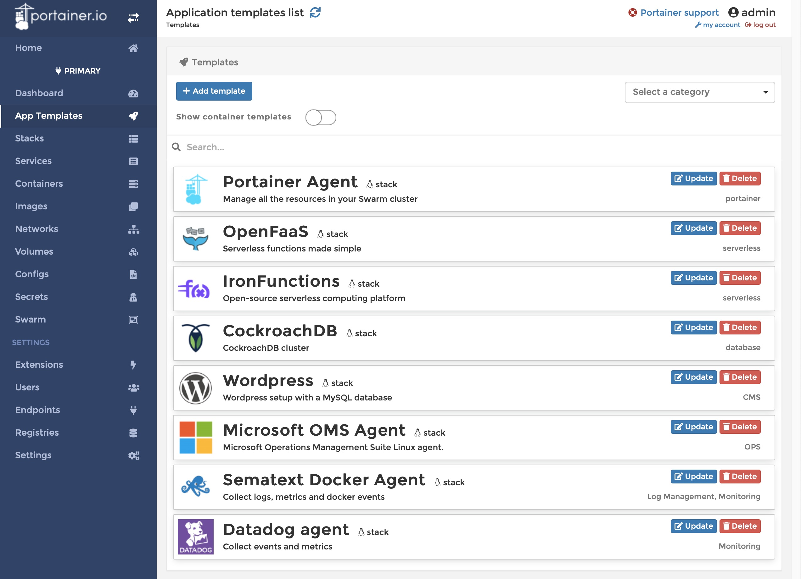

zero - Infrastructure in a Box
===

This README will hold an overview of the contents of this repo. This is **WIP**.

# Table of Contents
[[_TOC_]]

# Overview
This repository contains the code for the **zero** DevOps Platform. The code composes of a variety of mechanisms and tools that, together, build a Docker Swarm or Kubernetes Based Platform and Backplane for modern App Deployments. The platform additionally features a distributed Storage Layer implemented with **Storidge**`**, spanning across Workers and Managers.

**The goal for zero is to get teams up and running fast, with a set of services to help them and infrastructure they do not need to worry about.**

This is an example of what the deployment of and work with **zero** looks like:

## Backplane Services

**Portainer** is intended to become the single management UI for applications and services operated on **zero**. In the future more app templates will be provided here.

**Traefek** acts as the single proxy to manage connections between all services on **zero**, backplane AND custom. From the traefek dashboard (endpoint `proxy.<hostname>`) you can see all frontend and backend services with their addresses within the cluster/swarm.

**Grafana** is single entry point for troubleshooting, logs access and alerts. The logs of all nodes are stored on the node where they stem from and consolidated on manager nodes for access through grafana. **Loki** is used for this. **Prometheus** provides alerts and metrics on node level and consolidates them as well. **Grafana** accesses data from all these sources to provide a consoldated view on the health of the cluster/swarm and the services and applications running on it. Predefined dashboards, e.g. on data provided by **Loki** are available after installation. **Unsee** is used for a dedicated view on alerts.  **zero** comes with a set of predefined alerts around the area of hardware thresholds and such, as part of the **Prometheus** [configuration](https://gitlab.com/peter.saarland/zero/-/tree/master/docker/prometheus/config).

More services used behind the curtains are:
- [node_exporter](https://github.com/prometheus/node_exporter) to access hardware metrics on each node
- [ansible-role-ntp](https://github.com/geerlingguy/ansible-role-ntp) for node time synchronization

## Additional Services

- **Let's Encrypt** is used to issue certificates for zero services via DNS validation through **Traefek**
- **GitLab Runner** 
- **Nextcloud**

# Roadmap

Work in progress by @derfabianpeter.

Open topics are:
- **Backup & restore** with an own versioning mechanism of the snapshots to be stored on storages like AWS S3
- **DNS**: Currently docker swarm does internal DNS resolution for all nodes, which does not support access to hosts outside of the swarm. Prometheus and other services in the backplane can cope with multiple IPs being resolved for a single hostname. However this is not depictable in the host OSs `/etc/hosts` file. Hence **zero** needs a more sophisticated DNS solution.
- Deployment on **Windows** hosts
- Change from **ansible** templates used to setup infrastructure, backplane and such to **compose** files
- A dedicated CLI to make interacting with **zero** easier
- Deployment an **ARM** (Raspberry)
- Automatic detection of interface names other than `eth1`

# Prerequisites

Currently, the Platform is designed to be run on Digitalocean, but any setup matching the following prerequisites should be able to operate **zero**:

## Minimum Requirements
- 1+ Ubuntu 18.04/Debian 10 Servers
- 4GM RAM
- 1 CPUs
- 20GB Local Disk

## Requirements for Storidge
- 4+ Ubuntu 18.04 Servers (with Kernel **4.15.0-74-generic**)
- 16GB RAM
- 4 CPUs
- 100GB Local Disk
- 3x 50GB+ raw Block Devices (unformatted disks, e.g. Block-Volumes from DigitalOcean)

# Configuration
**zero** accepts all configuration through Environment Variables. The available configuration options can be found in `.env.example`.

# Authentication
If not managed by another service (Auth0, LDAP, etc) authentication to all services inside the Platform is defined in variables `ADMIN_USER` and `ADMIN_PASSWORD`.

# Running it
Here's what you have to do to spin up **zero**:

⚠️ This setup assumes using terraform against an existing cluster with a certain configuration. To run **zero** against a single Ubuntu VM, see 

1. Create the `.env` file with your settings (Hint: copy from `.env.example `)
2. Make sure **Docker** is installed
3. Have 1+ Servers ready with your SSH public key
4. Run **zero**: `docker run -v "${PWD}/.env:/infrastructure/.env" -v "${HOME}/.ssh:/.ssh" registry.gitlab.com/derfabianpeter/zero:latest ./if0 provision`

## On DigitalOcean

This is intended to be the minimal step required to run zero on a single Ubuntu VM meeting the , running on DigitalOcean.

### Prerequisites 

- Install terraform on your local machine
- Run `terraform init` once in the project root
- Install and run docker on your local machine
- Check the [configuration](#configuration) and [authentication](#authentication) sections above.

### Steps

1. Create the `.env` file with your settings (Hint: copy from `.env.example `)
2. Set
   - `DIGITALOCEAN_ENABLED=1`
   - `DIGITALOCEAN_AUTH_TOKEN` to your access token
   - `SSH_PRIVATE_KEY_FILE` to an existing ssh key or a non-existing one if you want to create a new one, e.g. `~/.ssh/id_rsa_zero`
   - `REMOTE_USER=root` Deployment via `root` is required currently, due to assumptions other projects used by **zero** made
3. (Optional) Run `make ssh-gen` to generate the new ssh key if its not existing yet
4. Run `make setup`, this will create the Ubuntu droplet in your default project
5. Run `make show` and copy the `ipv4_address` of the newly created VM
6. Paste the address to the following variables in the `.env` file: `INGRESS_IP=<ipv4>`, `ZERO_NODES=<ipv4>`, `BASE_DOMAIN=<ipv4>.xip.io`
7. Run `make deploy` to deploy zero with all backplane services to the VM

    ℹ️ This command can be re-run over and over when making changes to the infrastructure, services or doing troubleshooting.

8. (Optional) Run `make teardown` to stop and delete the VM.

### Endpoints

- Portainer: `portainer.<ipv4address>.xip.io`
- Grafana: `grafana.<ipv4address>.xip.io`
- Traefek: `proxy.<ipv4address>.xip.io`
- Unsee: `alerts.<ipv4address>.xip.io`

### Troubleshooting

**The deployment complains about the network interface `eth1` not being available**

Ubuntu can choose different names for its network interfaces and **zero** currently cannot cope with that. To workaround that issue:

- ssh into VM via `make ssh` and run `ifconfig` to find the correct name of the adapter (check for the IP)
- set the `PUBLIC_INTERFACE` and `PRIVATE_INTERFACE` variables in `.env` to the correct name

**I've created my infrastructure with `docker-machine` and now the `Checking on Docker Installation` step fails**

`docker-machine` already installs a newer version of Docker on the VM compared to the one **zero** uses. Unfortunately ansible is not capable allowing downgrades during installation (see [this issue](https://github.com/ansible/ansible/issues/29451)).
