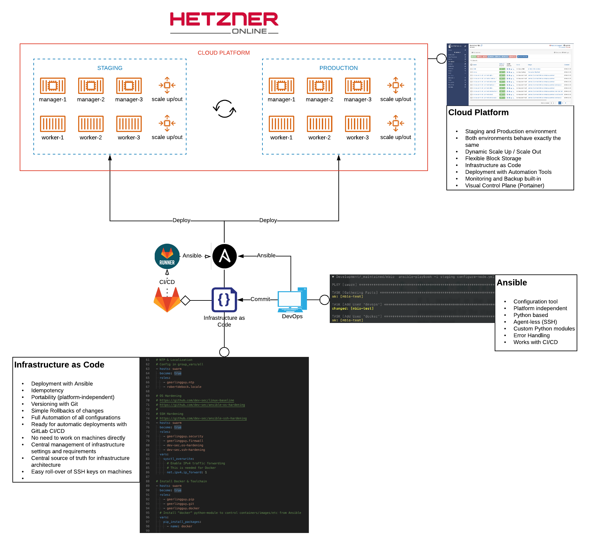
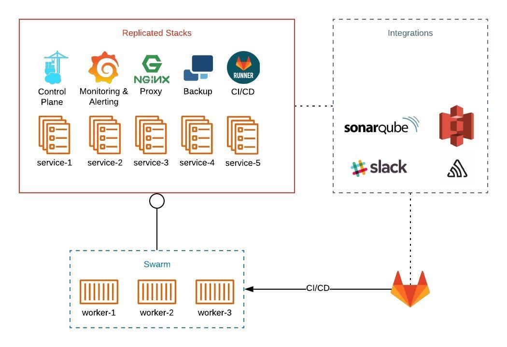

DevOps for MBIO Cloud Strategy
=== 

Revised Project Map: 10.10.2019
# Timeline
## 1. Revise the State of Work (3d)
From Oct. 8th to 10th, the original Project plan has been evaluated and revised on-site at Micro-Biolytics in Esslingen. The concept has been proven and will now be designed and implemented according to the specifications developed in this time.

## 2. Design the Infrastructure & Environments (5d)
The current staging environment is a good starting point. To ensure secure and transparent operation of the MBIO Cloud, all 3 Environments (Development, Staging, Production) will be re-designed according to current Best Practices in accordance with the needs of Micro-Biolytics. All 3 Environments should and will be *the same* to ensure a minimized vector for side-effects when deploying to the different environments. 

Each environment should have it's own Monitoring, Control-Plane, Backup and GitLab Runners to be as independent as possible.

Each Environment should also run in a dedicated Swarm to isolate everything properly and thus reduce side-effects.

Below is a very high-level overview of the underlying infrastructure and how it's being deployed and managed.

All infrastructure is written in code and will be deployed according to a fine-tuned workflow that guarantees consistency throughout the entire system. The infrastructure design is idempotent, meaning any app, service or resource is designed to be stateless and exchangable. All of this will be handled by [Ansible](https://www.ansible.com/). This concept is called [Immutable Infrastructure](https://www.hashicorp.com/resources/what-is-mutable-vs-immutable-infrastructure).

The whole system will be designed according to the following principles:

- Everything is Code
- Prepare for Scale
- Prepare for Features
- Platform-Agnostic (as much as possible; should work on any Platform that supports Docker, regardless of the OS)
- Maximum Visibility & Transparency (i.e. "What is actually happening?")
- Ease of Operation (Clear maintenance routines)
- Ease of Recovery (Working Backups!)
- Best User and Developer experience

The design will account for a later implementation of:

- Hashi-Stack (further Automation of Infrastructure)
- On-Premise installations
- Log-Aggregation

The design also contains a clear path for scaling up or out.

## 3. Implementation of the Environments (21d)
After the actual design has been proven and approved, all 3 environments will be built and put to work so they can be tested intensively.

This includes the implementation and adjustment of all necessary CI/CD Piplines. After this stage is finished, all 3 environments should be ready to run automated services deployed by pipelines triggered by Developer commits.

This takes into account signing, validation and scanning of Docker images, Code Quality Checks, Test- and Linter-Stages during Pipelines, automated as well as manually triggered deployments to environments and a path to implement further features to the design.

## 3.1 Implementation of Data Persistence (10d)
The Cloud Platform needs some kind of Data Persistence to function properly in a distributed environment. In a phone call with Adrian Marsch on Oct. 29th 2019 we concluded to go ahead with the implementation of [Storidge](https://storidge.com/) as storage controller. Further options (GlusterFS, Portworx, ...) have been discussed and discarded for now as the project is on a very tight schedule. 

The implementation of Storidge imposes additional hosting-costs as it depends on the availability of 3 RAW block devices on the underlying node which will be achieved by mounting 3 additional block volumes from HETZNER into the server node. Block Storage costs depend on disk size.

## 4. Monitoring & Alerting (10d)
This is a key part of the project. As long as everything is running as expected, everything is fine. But once something unexpected happens and users experience errors, you'll want to be able to inspect, analyze and change every bit of the infrastructure and platform.

Thus, every moving part (including Backups, API Connections, Authentication Errors, etc) will be closely monitored and aggregated by a TIG Stack. Visualization will be achieved with Grafana. This enables Devs and Ops to pro-actively deploy changes, fixes and improvements based on historical and live data from the Monitoring stack. Together with tools like Sentry, a well designed and implemented Monitoring stack makes it easy to pin-point errors to specific Commits which in turn speeds up service restoration. 

Additionally, well designed Notifications (with reduced false-positive rates) give Developers and Ops quick feedback about the health of the platform and incentive to act. 

Monitoring and Notifications are part of Systems Reliability Engineering (SRE).

The SRE Measurements include:

- Submitting monitoring data from as much parts of the infrastructure as possible to a TSDB (InfluxDB)
- Aggregating the data to make decisions about platform health
- Display the state of the infrastructure in informative Grafana Dashboards according to best practices and specific needs of Micro-Biolytics
- Alert in case of errors (or error predictions)
- If possible, automatically handle errors (e.g. re-start a service)

## 5. Backup & Recovery (10d)
There will be multi-level backups. All named Docker-Volumes of any environment (except Development) will be regularily backed up to an S3-compatible data-store that can be hosted on an additional machine. Backups can be encrypted as well.

An additional level of backups will be needed for databases which will be logically backed up (i.e. SQL-Dumps vs. Block-level Snapshots).

There will be a Desaster Recovery procedure as well as a Desaster Injection procedure that will be used regularily to proof the system is able to recover from catastrophic failure (think of [Chaos Monkey](https://github.com/Netflix/chaosmonkey)).

This is one of the most critical parts to get right as infrastructures are complex and any automated procedure is prone to failure (even Backups), thus the Backup & Recovery systems (also part of SRE) will need very resilient mechanisms and control-routines (by Ops) to verify functionality.

## 6. Security & Fine-Tuning (10d)
This is where the MBIO Cloud and its 3 environments are already up and running with all the previous parts done. 

Things like Server-Hardening have been implemented in Step 2 and are part of the Infrastructure as Code. This is the point where this will be reviewed and *intensively* tested. 

Additionally, any API-related Security & Control Mechanisms will be implemented and tuned at this stage as you need a reliably working platform before you can make good guesses about appropriate levels of security for the Edge (NGINX/Traefik) and Backend.

In this stage, Monitoring, Backups and other moving parts will be adjusted and tuned to Devs' and Ops' needs. In practice, you can't plan everything ahead and will implement lots of modifications and additional features that deviate from the original specifications along the way. These changes will be reviewed and hardened at this stage.

After this is finished, the MBIO Cloud should be operating.

# Recommendations
## Move Docker Registry to GitLab
Using the built-in GitLab Container registry enables access to further automations and integrations on the GitLab Platform (automatical vulnerability scans for images, etc). Additionally, staying within the same platform (GitLab) eases future migrations and enables MBIO to move from hosted GitLab to an on-premise solution without changing too many parts. This might be necessary for future customers that need an on-premise version of MBIO Cloud - then GitLab can simply be deployed on-site alongside the rest of the infrastructure.

## Coding Style: 12 Factor App
The [12 Factor App](https://www.12factor.net) is a methodology for building software-as-a-service apps that:

- Use declarative formats for setup automation, to minimize time and cost for new developers joining the project;
- Have a clean contract with the underlying operating system, offering maximum portability between execution environments;
- Are suitable for deployment on modern cloud platforms, obviating the need for servers and systems administration;
- Minimize divergence between development and production, enabling continuous deployment for maximum agility;
- And can scale up without significant changes to tooling, architecture, or development practices.

The twelve-factor methodology can be applied to apps written in any programming language, and which use any combination of backing services (database, queue, memory cache, etc).

It makes sense to get familiar with these coding and architecturing paradigms as distributed containerized applications are typically meant to be platform- and service-independent, stateless and quick to run/dispose. This implies a certain abstraction between parts of the software (code, data, config) as well as mechanisms that support scaling and quick setups.

Even if the current version (or vision) of the MBIO Cloud consists of "only" 10-15 services, it's absolutely necessary to plan for scale, migration, cloning of environments and quick recovery from desaster. This means additional work for the developer in the beginning, on the other hand frees the developer from being responsible for certain tasks that any 24/7 infrastructure comes with:

- Logging and Log-Rotation
- Error Handling
- App-internal Health-Checks
- Integrations with other services
- Maintenance
- Scaling
- Data & Config

Keeping a clean code-style for backend-services also eases development in the long run as every service can be expected to work, live and die the same way, thus many uncertainities of monolithic stateful apps just aren't a topic anymore.

## Docker, CI/CD
Within this repository there are templates for optimized docker-related configuration files, such as:

- .gitlab-ci.yml (advanced caching & secure eployment)
- Dockerfile (advanced caching & versioning)

The configs have been optimized to reduce code-redundancy and increase the speed of container builds and startups by orders of magnitude. Even in "small" infrastructures, speed is a key factor for quality of service, good customer experience and high availability. Optimized build and deploy mechanisms also speed up development in general and the release of fixes for critical bugs.

Additionally, make good use of the **ENTRYPOINT** feature as discussed. This enables things like DB Migrations or other service-bound maintenance tasks on certain conditions on container startup and removes the need to manually execute commands within the container with `docker run`.

The templates should be taken as a **Best Practice** advice and will (should) be optimized further during the development and operation of the MBIO Cloud (e.g. Multi-Stage builds are a necessity for dependency-heavy apps based on NodeJS/Angular to keep containers small).

## Docker Volumes
Use Docker Named Volumes instead of Filesystem paths. This enables you to later move those volumes to another storage driver (a distributed block-storage for example) without changing the Stack Files.

## Infrastructure Platform
Instead of hosting on dedicated root servers, I'd advise to move to a german "Cloud Provider" (HETZNER). 

1. Servers can be provisioned programmatically as part of the Infrastructure as Code
2. Servers can be scaled up (also automatically depending on the load of the platform, if needed)
3. Servers can be scaled out if needed
4. Pricing is very transparent
5. Internal networks between nodes are possible (++ Security)

HETZNER is just one possible option, but with pricing and features it can be compared to DigitalOcean/AWS while still being responsible for execution of GDPR. Of course any other Hoster is viable, too. HETZNER would be a good choice though.

## Python Apps
Python-based services should be reviewed if they can make use of a WSGI server instead of direct execution (e.g. GUnicorn). Also, stick with *requirements.txt* for any Python-dependency instead of installing it manually in a Dockerfile. This speeds up build-times and simplifies development by reducing edge-cases.

## Versioning
It's advised to implement proper versioning (e.g. SEMVER) for **ALL** in-house built services, apps, libs and dependencies used in the MBIO Cloud. Additionally, dependency-injection (i.e. requirements.txt, package.json) should be pin-pointed to specific versions instead of going with "latest". The same goes for any Docker image that is referenced.

Once the MBIO Cloud is in production, any non-specific dependency (i.e. "latest") becomes a potential security and availability risk. In today's software architecture, "dependency hell" is basically implied and the technical debt resulting from it should be minimized as much as possible early on.

Specific versioning adds additional management overhead for any dependency that is used in the infrastructure (i.e. regular checks for appropriate updates of specific dependencies need to be done) but also makes it possible to exactly define a **working version** of the whole cloud that can be reduced to a specific set of **Commits** in the respective respositories. That makes Roll-Backs almost painless.

## Environments
Currently, the strategy is to go with 3 environments: Development, Staging and Production. I'd advise to:

1. Do not mix, re-use or shorten the names of the environment (i.e. stage, prod, etc). This leads to confusion in agile, distributed teams
2. All 3 environments should look, feel and work the same. With modern technology, even a local development environment doesn't need to be "hacky" anymore but can easily reflect the production environment. This means, no "quick fixes", "temporary solutions" and "bandaids" should be applied to any environment without applying it to **all environments**. In the beginning, this again causes overhead, but in the long run it helps spotting errors, bugs, blockers and problems early on in the Developer's local environment which will reduce downtimes, rollbacks and unintended side-effects in Staging and Production. **Infrastructure as Code** eases this process a lot.
3. Additional environments (second Staging for on-premise versions of the Cloud with a different code-base) can easily be implemented by simply defining it and adjusting all necessary parts of the infrastructure Code.

## GitLab Integrations
Explore GitLab's available integrations for Sentry, Slack, SonarCube etc. Since you've already picked some of the most popular services, it makes sense to integrate them top-level and not within the services' code. 

## Make use of Sentry. A lot.
Sentry gives deep and easy insights to what's happening within your services once they're getting used. Instead of simple Error Logging or custom Slack Notifications in the code, let Sentry handle it. Since it can be integrated with GitLab directly, you're on click away from creating a GitLab Issue out of a Sentry Event. Connections like these provide the development team with lots of data and context and helps making quicker and better decisions. Sentry itself has [additional integrations](https://sentry.io/integrations/) for Project Management, Notifications (Slack), Auth (Auth0) and Monitoring (Graphite).

## Data Persistence
Currently, there's no concept for data persistence within the Swarm, thus there's no real high-availability and auto-scaling possible for those services that require persistent volumes (Databases). I'd advised to prioritize finding a solution for this as the Data managed by MBIO Cloud is the most prominent part of the whole solution.

Possible solutions include GlusterFS, Storidge (Swarm-optimized), Ceph or S3-Volumes. 

## Databases
Make good decisions on the databases you use. There are lots of general purpose as well as highly optimized database-solutions out there that can be leveraged for long-term relational storage as well as analytical/statistical compute operations and each solution has its pros and cons. Making a good and future-proof decision for each service that needs a database-backend is key for low frustration in the long run as migrating databases is a painful task in a live-system.

## Misc
- Log to STDOUT in any app or service. Don't use logfiles. STDOUT will be collected by the Docker Daemon and can then be redistributed to a central Logging Service (e.g. Graylog, ELK, Datadog, etc) or viewed within Portainer directly
- Implement a [HEALTHCHECK](https://docs.docker.com/engine/reference/builder/#healthcheck) for every app or service (e.g. `curl http://miradock/ping` should return 200 if the service is operational); these will be used on image-level by the Swarm to check the health of a single container and act upon it if necessary (re-scale, re-start, etc)
- Pick a namespace for the environments as well as Infrastructure parts, for example:
  - mbiosphere.com (Production)
  - staging.mbiosphere.com (Staging)
  - monitoring.staging.mbiosphere.com (Grafana)
  - dev.mbiosphere.com (Resolving to 127.0.0.1 -> Developer Machine)
  - ...
- Pick a good DNS provider (Cloudflare, Digitalocean) that can be automated (Infrastructure and Cloud-Platform can make use of Auto-SSL and Auto-DNS and thus reduce administrative tasks when implementing anything new or changing anything within the Cloud); this also eases on-site/behind-firewall implementations of the MBIO Cloud for customers if needed in the future